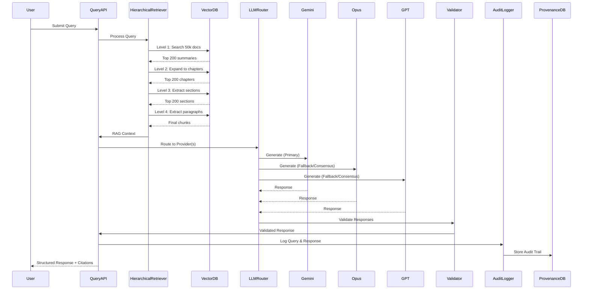

# Technical PRD: LLM Integration with Hierarchical RAG and Auditability

**Version:** 1.0  
**Date:** 2025-01-27  
**Status:** Draft  
**Priority:** High  
**Agent-Native Format:** Yes

---

## 1. Executive Summary

### 1.1 Purpose
Integrate multi-provider LLM support (Gemini 3, Opus 4.5, GPT 5.2) with hierarchical RAG retrieval, comprehensive audit trails, and hybrid hallucination prevention for legal verification use cases in the POFact parliamentary fact-checking platform.

### 1.2 Objectives
- **Primary**: Enable accurate, verifiable LLM-powered query responses with full source attribution
- **Secondary**: Implement hierarchical retrieval to reduce semantic collapse (50k → 200 → 200 → 200 → final chunks)
- **Tertiary**: Build comprehensive audit trails for legal compliance and verification

### 1.3 Success Metrics
- **Retrieval Quality**: Precision ≥ 0.85, Recall ≥ 0.80 at each hierarchy level
- **Hallucination Rate**: < 2% unsupported claims in responses
- **Audit Completeness**: 100% of transformations logged with provenance
- **Response Time**: < 5s for hierarchical retrieval + LLM generation

---

## 2. Technical Architecture

flowchart TD
    UserQuery[User Query] --> QueryProcessor[Query Processor]
    QueryProcessor --> HierarchicalRetriever[Hierarchical Retriever]
    
    HierarchicalRetriever --> Level1[Level 1: Encyclopedia<br/>50k docs → 200 candidates]
    Level1 --> Level2[Level 2: Chapter<br/>200 → 200 candidates]
    Level2 --> Level3[Level 3: Section<br/>200 → 200 candidates]
    Level3 --> Level4[Level 4: Paragraph<br/>200 → Final chunks]
    
    Level4 --> RAGContext[RAG Context Builder]
    RAGContext --> MultiProviderLLM[Multi-Provider LLM Router]
    
    MultiProviderLLM --> Gemini[Gemini 3]
    MultiProviderLLM --> Opus[Opus 4.5]
    MultiProviderLLM --> GPT[GPT 5.2]
    
    Gemini --> ResponseValidator[Response Validator]
    Opus --> ResponseValidator
    GPT --> ResponseValidator
    
    ResponseValidator --> CrossVerify[Cross-Source Verification]
    CrossVerify --> AuditLogger[Audit Logger]
    AuditLogger --> StructuredOutput[Structured Output with Citations]
    StructuredOutput --> UserResponse[User Response]
    
    AuditLogger --> ProvenanceDB[(Provenance Database)]
    HierarchicalRetriever --> VectorDB[(Vector Database<br/>pgvector)]

### 2.1 System Components

```yaml
components:
  - name: Multi-Provider LLM Abstraction
    location: lib/llm/
    languages: [TypeScript]
    dependencies: [@langchain/core, @langchain/google-genai, @anthropic-ai/sdk, openai]
    
  - name: Hierarchical RAG Retriever
    location: lib/rag/
    languages: [TypeScript, Python]
    dependencies: [pgvector, langchain]
    
  - name: Audit Trail System
    location: lib/audit/
    languages: [TypeScript]
    dependencies: [@supabase/supabase-js]
    
  - name: Validation & Verification
    location: lib/validation/
    languages: [TypeScript]
    dependencies: [zod]
    
  - name: API Integration Layer
    location: src/app/api/
    languages: [TypeScript]
    dependencies: [next]
    
  - name: Python Retrieval Service
    location: backend/
    languages: [Python]
    dependencies: [flask, langchain, pgvector]
```

### 2.2 Data Flow



---

## 3. Database Schema Extensions

### 3.1 New Tables

**File:** `database/schema.sql`

```sql
-- Document Hierarchy Table
CREATE TABLE document_hierarchy (
  id TEXT PRIMARY KEY,
  parent_document_id TEXT REFERENCES documents(id),
  child_document_id TEXT REFERENCES documents(id),
  hierarchy_level INTEGER NOT NULL CHECK (hierarchy_level BETWEEN 1 AND 4),
  relationship_type TEXT NOT NULL, -- 'encyclopedia', 'chapter', 'section', 'paragraph'
  created_at TIMESTAMPTZ DEFAULT NOW(),
  UNIQUE(parent_document_id, child_document_id)
);

-- LLM Providers Configuration
CREATE TABLE llm_providers (
  id TEXT PRIMARY KEY,
  provider_name TEXT NOT NULL, -- 'gemini', 'anthropic', 'openai'
  model_name TEXT NOT NULL, -- 'gemini-3.0', 'claude-opus-4.5', 'gpt-5.2'
  api_key_encrypted TEXT, -- Encrypted API keys
  is_active BOOLEAN DEFAULT true,
  priority INTEGER DEFAULT 0, -- Lower = higher priority
  cost_per_1k_tokens DECIMAL(10,6),
  max_tokens INTEGER,
  rate_limit_per_minute INTEGER,
  created_at TIMESTAMPTZ DEFAULT NOW(),
  updated_at TIMESTAMPTZ DEFAULT NOW()
);

-- Query Audit Trail
CREATE TABLE query_audit_trail (
  id TEXT PRIMARY KEY,
  query_text TEXT NOT NULL,
  query_params JSONB,
  user_id TEXT,
  session_id TEXT,
  retrieval_path JSONB NOT NULL, -- Array of document IDs at each level
  llm_provider_used TEXT REFERENCES llm_providers(id),
  llm_response_raw TEXT,
  llm_response_structured JSONB,
  validation_results JSONB,
  source_composition_graph JSONB, -- Graph structure of source combinations
  confidence_scores JSONB, -- Confidence at each step
  execution_time_ms INTEGER,
  created_at TIMESTAMPTZ DEFAULT NOW()
);

-- Retrieval Metrics
CREATE TABLE retrieval_metrics (
  id TEXT PRIMARY KEY,
  query_id TEXT REFERENCES query_audit_trail(id),
  hierarchy_level INTEGER NOT NULL,
  total_candidates INTEGER,
  retrieved_count INTEGER,
  relevant_count INTEGER, -- Ground truth labels
  precision DECIMAL(5,4),
  recall DECIMAL(5,4),
  f1_score DECIMAL(5,4),
  avg_similarity_score DECIMAL(5,4),
  created_at TIMESTAMPTZ DEFAULT NOW()
);

-- Source Compositions
CREATE TABLE source_compositions (
  id TEXT PRIMARY KEY,
  query_id TEXT REFERENCES query_audit_trail(id),
  claim_id TEXT NOT NULL, -- Identifier for the claim being verified
  source_document_ids TEXT[] NOT NULL,
  composition_type TEXT NOT NULL, -- 'combined', 'verified', 'contradicted'
  confidence_score DECIMAL(3,2),
  verification_status TEXT, -- 'verified', 'contradicted', 'unverified'
  created_at TIMESTAMPTZ DEFAULT NOW()
);
```

### 3.2 Schema Modifications

```sql
-- Add hierarchy columns to documents table
ALTER TABLE documents 
  ADD COLUMN hierarchy_level INTEGER DEFAULT 1 CHECK (hierarchy_level BETWEEN 1 AND 4),
  ADD COLUMN parent_document_id TEXT REFERENCES documents(id),
  ADD COLUMN compressed_summary TEXT,
  ADD COLUMN embedding vector(1536); -- Using OpenAI embedding dimension

-- Create indexes for hierarchical traversal
CREATE INDEX idx_documents_hierarchy_level ON documents(hierarchy_level);
CREATE INDEX idx_documents_parent_id ON documents(parent_document_id);
CREATE INDEX idx_documents_embedding ON documents USING ivfflat (embedding vector_cosine_ops) WITH (lists = 100);

-- Create indexes for audit trail queries
CREATE INDEX idx_audit_trail_query_text ON query_audit_trail USING gin(to_tsvector('english', query_text));
CREATE INDEX idx_audit_trail_created_at ON query_audit_trail(created_at);
CREATE INDEX idx_audit_trail_provider ON query_audit_trail(llm_provider_used);
```

---

## 4. API Specifications

### 4.1 Unified Query Endpoint

**Endpoint:** `POST /api/query`

**Request Schema:**
```typescript
interface QueryRequest {
  query: string;
  options?: {
    provider?: 'gemini' | 'anthropic' | 'openai' | 'auto';
    max_results?: number; // Default: 10
    min_confidence?: number; // Default: 0.7
    enable_cross_verification?: boolean; // Default: true
    include_audit_trail?: boolean; // Default: true
  };
}
```

**Response Schema:**
```typescript
interface QueryResponse {
  success: boolean;
  answer: string;
  citations: Citation[];
  confidence: number;
  unsupported_claims: string[];
  source_lineage: ProvenanceGraph;
  audit_trail_id?: string;
  retrieval_metrics?: RetrievalMetrics;
  error?: string;
}

interface Citation {
  document_id: string;
  document_title: string;
  source_name: string;
  source_url: string;
  quote: string; // Exact quote from document
  relevance_score: number;
  hierarchy_level: number;
}

interface ProvenanceGraph {
  nodes: ProvenanceNode[];
  edges: ProvenanceEdge[];
}

interface ProvenanceNode {
  id: string;
  type: 'document' | 'claim' | 'validation' | 'composition';
  metadata: Record<string, any>;
}

interface ProvenanceEdge {
  from: string;
  to: string;
  relationship: string;
  confidence: number;
}

interface RetrievalMetrics {
  level_1: { precision: number; recall: number; f1: number };
  level_2: { precision: number; recall: number; f1: number };
  level_3: { precision: number; recall: number; f1: number };
  level_4: { precision: number; recall: number; f1: number };
}
```

### 4.2 Audit Trail Retrieval Endpoint

**Endpoint:** `GET /api/audit/:audit_trail_id`

**Response Schema:**
```typescript
interface AuditTrailResponse {
  id: string;
  query_text: string;
  query_params: Record<string, any>;
  retrieval_path: {
    level_1: string[];
    level_2: string[];
    level_3: string[];
    level_4: string[];
  };
  llm_provider: string;
  llm_response_raw: string;
  llm_response_structured: QueryResponse;
  validation_results: ValidationResult[];
  source_composition_graph: ProvenanceGraph;
  confidence_scores: {
    retrieval: number;
    llm_generation: number;
    validation: number;
    final: number;
  };
  execution_time_ms: number;
  created_at: string;
}
```

### 4.3 Backend Python Endpoints

**File:** `backend/app.py`

```python
@app.route('/api/hierarchical-search', methods=['POST'])
def hierarchical_search():
    """
    Perform hierarchical retrieval across 4 levels
    Returns: JSON with retrieval results at each level
    """
    pass

@app.route('/api/validate-document', methods=['POST'])
def validate_document():
    """
    Validate a document against sources
    Returns: Validation result with provenance
    """
    pass

@app.route('/api/process-query', methods=['POST'])
def process_query():
    """
    Process query using hierarchical RAG + LLM
    Returns: Structured response with citations
    """
    pass
```

---

## 5. Implementation Specifications

### 5.1 Multi-Provider LLM Abstraction

**File:** `lib/llm/providers/base.ts`

```typescript
export interface LLMProviderConfig {
  provider: 'gemini' | 'anthropic' | 'openai';
  model: string;
  apiKey: string;
  temperature?: number;
  maxTokens?: number;
}

export interface LLMResponse {
  content: string;
  citations: Citation[];
  confidence: number;
  unsupported_claims: string[];
  metadata: Record<string, any>;
}

export abstract class LLMProvider {
  protected config: LLMProviderConfig;
  
  abstract generate(
    prompt: string, 
    context: string[], 
    options?: GenerateOptions
  ): Promise<LLMResponse>;
  
  abstract stream(
    prompt: string, 
    context: string[], 
    options?: GenerateOptions
  ): AsyncGenerator<string>;
  
  abstract validate(response: LLMResponse, sources: Document[]): ValidationResult;
}
```

**File:** `lib/llm/providers/gemini.ts`

```typescript
import { GoogleGenerativeAI } from '@google/generative-ai';
import { LLMProvider, LLMProviderConfig, LLMResponse } from './base';

export class GeminiProvider extends LLMProvider {
  private genAI: GoogleGenerativeAI;
  
  constructor(config: LLMProviderConfig) {
    super();
    this.config = config;
    this.genAI = new GoogleGenerativeAI(config.apiKey);
  }
  
  async generate(
    prompt: string, 
    context: string[], 
    options?: GenerateOptions
  ): Promise<LLMResponse> {
    const model = this.genAI.getGenerativeModel({ 
      model: this.config.model,
      generationConfig: {
        temperature: this.config.temperature || 0.3,
        maxOutputTokens: this.config.maxTokens || 2048,
      }
    });
    
    // Build RAG prompt with context
    const ragPrompt = this.buildRAGPrompt(prompt, context);
    
    // Use function calling for structured output
    const result = await model.generateContent({
      contents: [{ role: 'user', parts: [{ text: ragPrompt }] }],
      tools: [this.getCitationTool()],
    });
    
    return this.parseStructuredResponse(result.response);
  }
  
  private buildRAGPrompt(query: string, context: string[]): string {
    return `You are a legal fact-checking assistant. Answer the question using ONLY the provided sources. 
    
Sources:
${context.map((doc, i) => `[${i + 1}] ${doc}`).join('\n\n')}

Question: ${query}

Requirements:
1. Answer using ONLY information from the sources above
2. Cite sources using [1], [2], etc.
3. If information is not in sources, state "I cannot find this information in the provided sources"
4. Provide confidence score (0-1) based on source quality and completeness

Answer:`;
  }
  
  private getCitationTool() {
    // Function calling schema for structured output
    return {
      functionDeclarations: [{
        name: 'format_response',
        description: 'Format the response with citations and confidence',
        parameters: {
          type: 'OBJECT',
          properties: {
            answer: { type: 'STRING' },
            citations: {
              type: 'ARRAY',
              items: {
                type: 'OBJECT',
                properties: {
                  source_index: { type: 'NUMBER' },
                  quote: { type: 'STRING' },
                  relevance: { type: 'NUMBER' }
                }
              }
            },
            confidence: { type: 'NUMBER' },
            unsupported_claims: { type: 'ARRAY', items: { type: 'STRING' } }
          },
          required: ['answer', 'citations', 'confidence']
        }
      }]
    };
  }
}
```

**File:** `lib/llm/router.ts`

```typescript
import { GeminiProvider } from './providers/gemini';
import { AnthropicProvider } from './providers/anthropic';
import { OpenAIProvider } from './providers/openai';

export class LLMRouter {
  private providers: Map<string, LLMProvider>;
  private defaultProvider: string;
  
  constructor() {
    this.providers = new Map();
    this.initializeProviders();
  }
  
  async route(
    prompt: string, 
    context: string[], 
    options?: RouterOptions
  ): Promise<LLMResponse> {
    const providerName = options?.provider || this.defaultProvider;
    const provider = this.providers.get(providerName);
    
    if (!provider) {
      throw new Error(`Provider ${providerName} not found`);
    }
    
    try {
      return await provider.generate(prompt, context, options);
    } catch (error) {
      // Fallback to next provider
      if (options?.fallback !== false) {
        return this.fallback(prompt, context, providerName);
      }
      throw error;
    }
  }
  
  async consensus(
    prompt: string, 
    context: string[], 
    providers: string[]
  ): Promise<ConsensusResponse> {
    const responses = await Promise.all(
      providers.map(p => this.providers.get(p)?.generate(prompt, context))
    );
    
    return this.buildConsensus(responses);
  }
  
  private buildConsensus(responses: LLMResponse[]): ConsensusResponse {
    // Compare responses, find common claims, detect contradictions
    // Return consensus answer with confidence based on agreement
  }
}
```

### 5.2 Hierarchical RAG Retriever

**File:** `lib/rag/hierarchical-retriever.ts`

```typescript
export interface HierarchyLevel {
  level: 1 | 2 | 3 | 4;
  name: string;
  maxCandidates: number;
  compressionRatio: number;
}

export class HierarchicalRetriever {
  private levels: HierarchyLevel[] = [
    { level: 1, name: 'encyclopedia', maxCandidates: 200, compressionRatio: 0.1 },
    { level: 2, name: 'chapter', maxCandidates: 200, compressionRatio: 0.3 },
    { level: 3, name: 'section', maxCandidates: 200, compressionRatio: 0.5 },
    { level: 4, name: 'paragraph', maxCandidates: 50, compressionRatio: 1.0 },
  ];
  
  async retrieve(query: string, options?: RetrievalOptions): Promise<RetrievalResult> {
    const queryEmbedding = await this.embedQuery(query);
    const results: RetrievalResult = {
      level_1: [],
      level_2: [],
      level_3: [],
      level_4: [],
      metrics: {}
    };
    
    // Level 1: Search all documents (50k → 200)
    const level1Docs = await this.searchLevel(
      queryEmbedding, 
      1, 
      null, 
      this.levels[0].maxCandidates
    );
    results.level_1 = level1Docs;
    results.metrics.level_1 = await this.calculateMetrics(level1Docs, query);
    
    // Level 2: Expand to chapters (200 → 200)
    const level2Docs = await this.expandToLevel(
      level1Docs, 
      2, 
      this.levels[1].maxCandidates
    );
    results.level_2 = level2Docs;
    results.metrics.level_2 = await this.calculateMetrics(level2Docs, query);
    
    // Level 3: Extract sections (200 → 200)
    const level3Docs = await this.expandToLevel(
      level2Docs, 
      3, 
      this.levels[2].maxCandidates
    );
    results.level_3 = level3Docs;
    results.metrics.level_3 = await this.calculateMetrics(level3Docs, query);
    
    // Level 4: Extract paragraphs (200 → final chunks)
    const level4Docs = await this.expandToLevel(
      level3Docs, 
      4, 
      this.levels[3].maxCandidates
    );
    results.level_4 = level4Docs;
    results.metrics.level_4 = await this.calculateMetrics(level4Docs, query);
    
    return results;
  }
  
  private async searchLevel(
    queryEmbedding: number[], 
    level: number, 
    parentIds: string[] | null, 
    limit: number
  ): Promise<Document[]> {
    const { data, error } = await supabase
      .from('documents')
      .select('*')
      .eq('hierarchy_level', level)
      .order('embedding', { 
        ascending: false,
        foreignTable: 'documents',
        options: { 
          query: `embedding <-> '[${queryEmbedding.join(',')}]'::vector`,
          limit 
        }
      })
      .limit(limit);
    
    if (error) throw error;
    return data;
  }
  
  private async expandToLevel(
    parentDocs: Document[], 
    targetLevel: number, 
    limit: number
  ): Promise<Document[]> {
    const parentIds = parentDocs.map(d => d.id);
    
    // Get child documents at target level
    const { data, error } = await supabase
      .from('document_hierarchy')
      .select('child_document_id, documents(*)')
      .in('parent_document_id', parentIds)
      .eq('hierarchy_level', targetLevel)
      .limit(limit);
    
    if (error) throw error;
    return data.map(d => d.documents);
  }
}
```

**File:** `lib/rag/compression.ts`

```typescript
export class DocumentCompressor {
  async compress(
    document: Document, 
    targetRatio: number, 
    preserveFields: string[] = ['citations', 'legal_references']
  ): Promise<Document> {
    // Use LLM to summarize while preserving key information
    const summary = await this.summarizeWithLLM(document, targetRatio, preserveFields);
    
    return {
      ...document,
      compressed_summary: summary,
      content: summary, // Use summary as content for higher levels
    };
  }
  
  private async summarizeWithLLM(
    doc: Document, 
    ratio: number, 
    preserve: string[]
  ): Promise<string> {
    const prompt = `Summarize this document to ${Math.round(doc.content.length * ratio)} characters.
    
Requirements:
- Preserve all legal citations and references
- Maintain factual accuracy
- Keep key dates, names, and policy details
- Preserve source attribution

Document:
${doc.content}`;
    
    // Use lightweight model for summarization
    const response = await this.llm.generate(prompt);
    return response.content;
  }
}
```

### 5.3 Audit Trail System

**File:** `lib/audit/provenance-tracker.ts`

```typescript
export class ProvenanceTracker {
  async trackQuery(query: QueryRequest, result: QueryResponse): Promise<string> {
    const auditId = generateId('audit');
    
    const auditRecord = {
      id: auditId,
      query_text: query.query,
      query_params: query.options,
      retrieval_path: {
        level_1: result.retrieval_path.level_1.map(d => d.id),
        level_2: result.retrieval_path.level_2.map(d => d.id),
        level_3: result.retrieval_path.level_3.map(d => d.id),
        level_4: result.retrieval_path.level_4.map(d => d.id),
      },
      llm_provider_used: result.provider,
      llm_response_raw: result.raw_response,
      llm_response_structured: result,
      validation_results: result.validation,
      source_composition_graph: this.buildCompositionGraph(result),
      confidence_scores: {
        retrieval: result.retrieval_confidence,
        llm_generation: result.llm_confidence,
        validation: result.validation_confidence,
        final: result.confidence,
      },
      execution_time_ms: result.execution_time,
    };
    
    const { error } = await supabase
      .from('query_audit_trail')
      .insert(auditRecord);
    
    if (error) throw error;
    return auditId;
  }
  
  private buildCompositionGraph(result: QueryResponse): ProvenanceGraph {
    const nodes: ProvenanceNode[] = [];
    const edges: ProvenanceEdge[] = [];
    
    // Add document nodes
    result.citations.forEach(citation => {
      nodes.push({
        id: citation.document_id,
        type: 'document',
        metadata: {
          title: citation.document_title,
          source: citation.source_name,
          hierarchy_level: citation.hierarchy_level,
        }
      });
    });
    
    // Add claim nodes
    result.claims?.forEach((claim, idx) => {
      const claimId = `claim_${idx}`;
      nodes.push({
        id: claimId,
        type: 'claim',
        metadata: { text: claim, confidence: claim.confidence }
      });
      
      // Link claims to documents
      claim.supporting_documents.forEach(docId => {
        edges.push({
          from: docId,
          to: claimId,
          relationship: 'supports',
          confidence: claim.confidence,
        });
      });
    });
    
    return { nodes, edges };
  }
}
```

### 5.4 Validation System

**File:** `lib/validation/response-validator.ts`

```typescript
export class ResponseValidator {
  async validate(
    response: LLMResponse, 
    sources: Document[]
  ): Promise<ValidationResult> {
    const claims = this.extractClaims(response.content);
    const validationResults = await Promise.all(
      claims.map(claim => this.validateClaim(claim, sources))
    );
    
    const unsupportedClaims = validationResults
      .filter(r => !r.supported)
      .map(r => r.claim);
    
    const confidence = this.calculateConfidence(validationResults);
    
    return {
      supported: unsupportedClaims.length === 0,
      unsupported_claims: unsupportedClaims,
      confidence,
      validation_details: validationResults,
    };
  }
  
  private async validateClaim(
    claim: string, 
    sources: Document[]
  ): Promise<ClaimValidation> {
    // Use embedding similarity to find supporting evidence
    const claimEmbedding = await this.embed(claim);
    
    const similarities = await Promise.all(
      sources.map(async (source) => {
        const similarity = await this.cosineSimilarity(
          claimEmbedding, 
          source.embedding
        );
        return { source, similarity };
      })
    );
    
    const maxSimilarity = Math.max(...similarities.map(s => s.similarity));
    const threshold = 0.75;
    
    return {
      claim,
      supported: maxSimilarity >= threshold,
      supporting_sources: similarities
        .filter(s => s.similarity >= threshold)
        .map(s => s.source.id),
      max_similarity: maxSimilarity,
    };
  }
}
```

---

## 6. Dependencies

### 6.1 TypeScript/Node.js

```json
{
  "dependencies": {
    "@langchain/core": "^0.3.0",
    "@langchain/google-genai": "^0.1.0",
    "@anthropic-ai/sdk": "^0.27.0",
    "openai": "^4.47.0",
    "@google/generative-ai": "^0.21.0",
    "zod": "^3.24.1"
  }
}
```

### 6.2 Python

```txt
langchain>=0.3.0
langchain-google-genai>=0.1.0
langchain-anthropic>=0.1.0
langchain-openai>=0.1.0
pgvector>=0.3.0
numpy>=1.24.0
psycopg2-binary>=2.9.0
```

---

## 7. Testing Requirements

### 7.1 Unit Tests

- **LLM Providers**: Test each provider's generate/stream/validate methods
- **Hierarchical Retriever**: Test each level's retrieval and compression
- **Validator**: Test claim extraction and validation logic
- **Provenance Tracker**: Test graph construction and storage

### 7.2 Integration Tests

- **End-to-End Query Flow**: Test complete query → retrieval → LLM → validation → audit
- **Multi-Provider Consensus**: Test consensus building across providers
- **Cross-Source Verification**: Test contradiction detection

### 7.3 Performance Tests

- **Retrieval Latency**: Measure time at each hierarchy level
- **LLM Response Time**: Measure generation time per provider
- **Audit Trail Storage**: Measure write performance

### 7.4 Quality Tests

- **Precision/Recall**: Benchmark against golden dataset
- **Hallucination Detection**: Test with known unsupported claims
- **Citation Accuracy**: Verify all citations are valid

---

## 8. Migration Strategy

### 8.1 Phase 1: Database Migration (Week 1)
1. Deploy schema extensions to Supabase
2. Migrate existing documents to hierarchy structure
3. Generate embeddings for all documents
4. Build hierarchy relationships

### 8.2 Phase 2: Backend Services (Week 2-3)
1. Implement hierarchical retriever in Python
2. Add LLM provider integrations
3. Build validation service
4. Create audit trail logging

### 8.3 Phase 3: Frontend Integration (Week 4)
1. Update query API endpoints
2. Integrate with existing UI components
3. Add citation display
4. Build audit trail viewer

### 8.4 Phase 4: Testing & Optimization (Week 5)
1. Run comprehensive test suite
2. Benchmark retrieval quality
3. Optimize performance
4. Fine-tune hierarchy levels

---

## 9. To-Do List

### 9.1 Database & Schema
- [ ] Create `document_hierarchy` table
- [ ] Create `llm_providers` table
- [ ] Create `query_audit_trail` table
- [ ] Create `retrieval_metrics` table
- [ ] Create `source_compositions` table
- [ ] Add `hierarchy_level`, `parent_document_id`, `compressed_summary` to `documents`
- [ ] Add `embedding` vector column to `documents`
- [ ] Create indexes for hierarchical traversal
- [ ] Create indexes for vector search (ivfflat)
- [ ] Create indexes for audit trail queries

### 9.2 LLM Provider Abstraction
- [ ] Create `lib/llm/providers/base.ts` with abstract class
- [ ] Implement `lib/llm/providers/gemini.ts`
- [ ] Implement `lib/llm/providers/anthropic.ts`
- [ ] Implement `lib/llm/providers/openai.ts`
- [ ] Create `lib/llm/router.ts` with routing logic
- [ ] Add consensus building logic
- [ ] Add fallback mechanism
- [ ] Add structured output enforcement

### 9.3 Hierarchical RAG
- [ ] Create `lib/rag/hierarchical-retriever.ts`
- [ ] Implement Level 1 retrieval (50k → 200)
- [ ] Implement Level 2 expansion (200 → 200)
- [ ] Implement Level 3 expansion (200 → 200)
- [ ] Implement Level 4 expansion (200 → final)
- [ ] Create `lib/rag/compression.ts` for summarization
- [ ] Create `lib/rag/embedding-service.ts` for embeddings
- [ ] Add caching layer for embeddings
- [ ] Implement precision/recall metrics collection

### 9.4 Python Backend Services
- [ ] Create `backend/hierarchical_retrieval_service.py`
- [ ] Integrate pgvector for vector search
- [ ] Implement 4-level retrieval algorithm
- [ ] Add metrics collection
- [ ] Update `backend/app.py` with new endpoints
- [ ] Implement `process_query()` function
- [ ] Implement `validate_document()` function
- [ ] Add error handling and logging

### 9.5 Audit Trail System
- [ ] Create `lib/audit/provenance-tracker.ts`
- [ ] Implement query tracking
- [ ] Build provenance graph construction
- [ ] Create `lib/audit/composition-tracker.ts`
- [ ] Implement source composition tracking
- [ ] Create `lib/audit/metrics-collector.ts`
- [ ] Implement precision/recall collection
- [ ] Add benchmarking against golden dataset

### 9.6 Validation System
- [ ] Create `lib/validation/response-validator.ts`
- [ ] Implement claim extraction
- [ ] Implement claim validation against sources
- [ ] Create `lib/validation/cross-verifier.ts`
- [ ] Implement cross-source verification
- [ ] Add contradiction detection
- [ ] Create `lib/validation/structured-output.ts`
- [ ] Enforce structured output schema (Zod)

### 9.7 API Integration
- [ ] Create `src/app/api/query/route.ts`
- [ ] Integrate hierarchical retriever
- [ ] Integrate LLM router
- [ ] Integrate validator
- [ ] Integrate audit logger
- [ ] Return structured response
- [ ] Create `src/app/api/audit/route.ts`
- [ ] Implement audit trail retrieval
- [ ] Add provenance graph queries

### 9.8 Frontend Components
- [ ] Update `src/components/features/AIQueryPane.jsx`
- [ ] Display structured citations
- [ ] Show confidence scores
- [ ] Add audit trail link
- [ ] Create `src/components/features/SourceCompositionView.jsx`
- [ ] Visualize provenance graph
- [ ] Enable source decomposition
- [ ] Create `src/components/features/RetrievalMetrics.jsx`
- [ ] Display precision/recall metrics
- [ ] Show hierarchy level performance

### 9.9 Testing
- [ ] Write unit tests for LLM providers
- [ ] Write unit tests for hierarchical retriever
- [ ] Write unit tests for validator
- [ ] Write integration tests for query flow
- [ ] Write performance tests
- [ ] Create golden dataset for benchmarking
- [ ] Run precision/recall benchmarks
- [ ] Test hallucination detection

### 9.10 Documentation
- [ ] Document API endpoints
- [ ] Document database schema
- [ ] Document LLM provider configuration
- [ ] Create deployment guide
- [ ] Create troubleshooting guide
- [ ] Document audit trail format

---

## 10. Risk Mitigation

### 10.1 Technical Risks
- **Semantic Collapse**: Mitigated by hierarchical retrieval with compression
- **LLM Hallucination**: Mitigated by RAG grounding + validation + structured output
- **Performance**: Mitigated by caching, indexing, and progressive filtering
- **Provider Failures**: Mitigated by multi-provider support and fallbacks

### 10.2 Data Risks
- **Embedding Quality**: Benchmark against golden dataset, fine-tune models
- **Hierarchy Construction**: Validate parent-child relationships
- **Audit Trail Completeness**: Comprehensive logging at each step

---

## 11. Success Criteria

### 11.1 Functional
- ✅ All queries return structured responses with citations
- ✅ 100% of queries have complete audit trails
- ✅ Multi-provider LLM routing works with fallbacks
- ✅ Hierarchical retrieval reduces search space effectively

### 11.2 Quality
- ✅ Precision ≥ 0.85 at each hierarchy level
- ✅ Recall ≥ 0.80 at each hierarchy level
- ✅ Hallucination rate < 2%
- ✅ Citation accuracy = 100%

### 11.3 Performance
- ✅ Query response time < 5s (p95)
- ✅ Retrieval time < 2s per level
- ✅ LLM generation time < 3s
- ✅ Audit trail storage < 100ms

---

**End of PRD**

