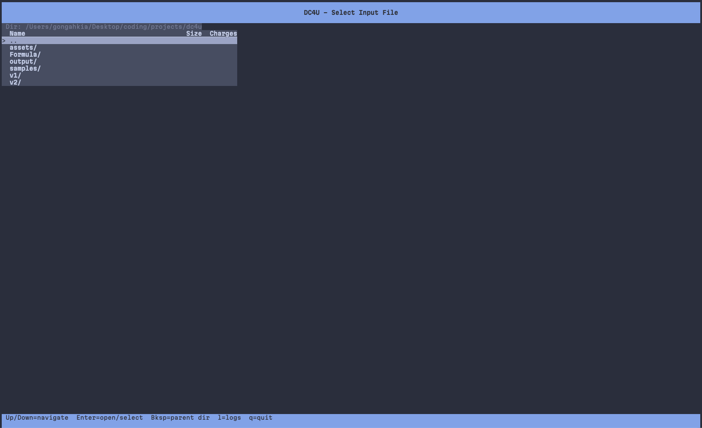
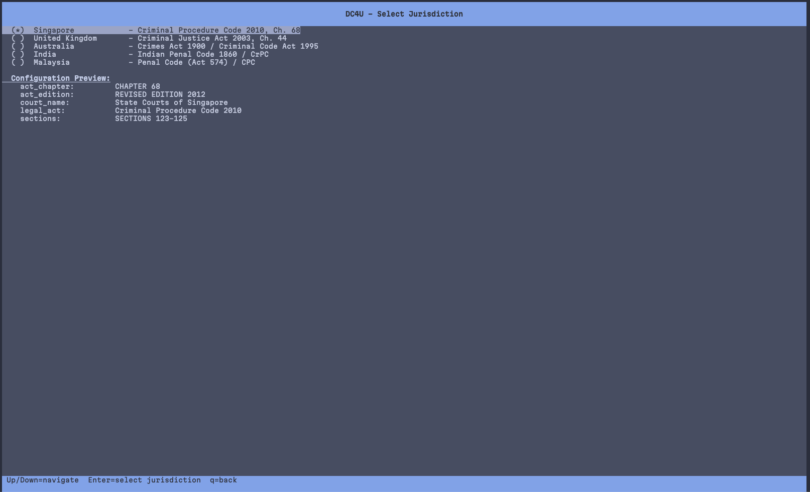
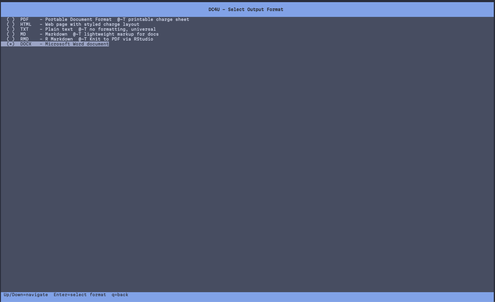
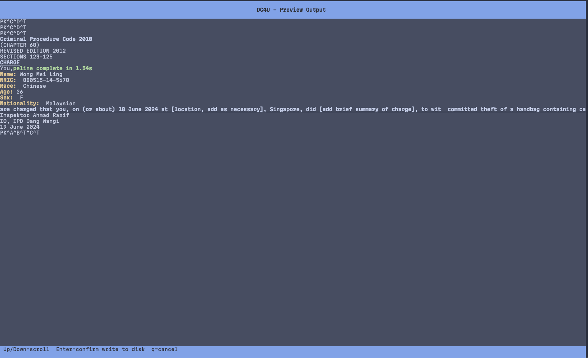
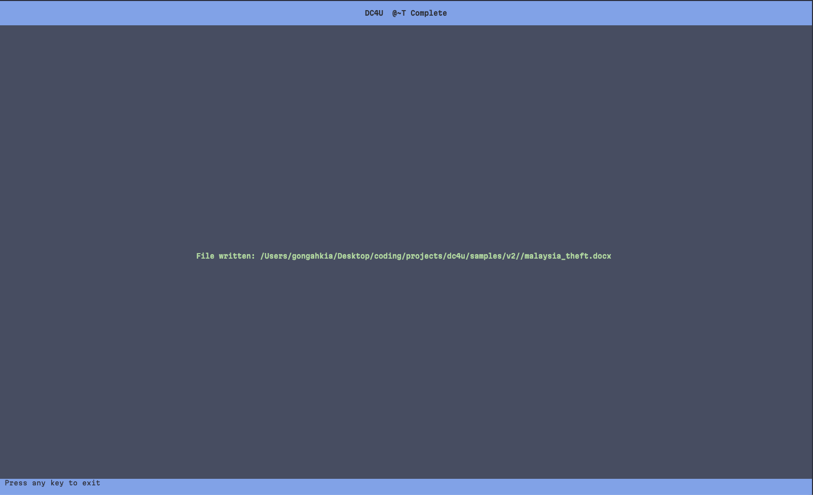
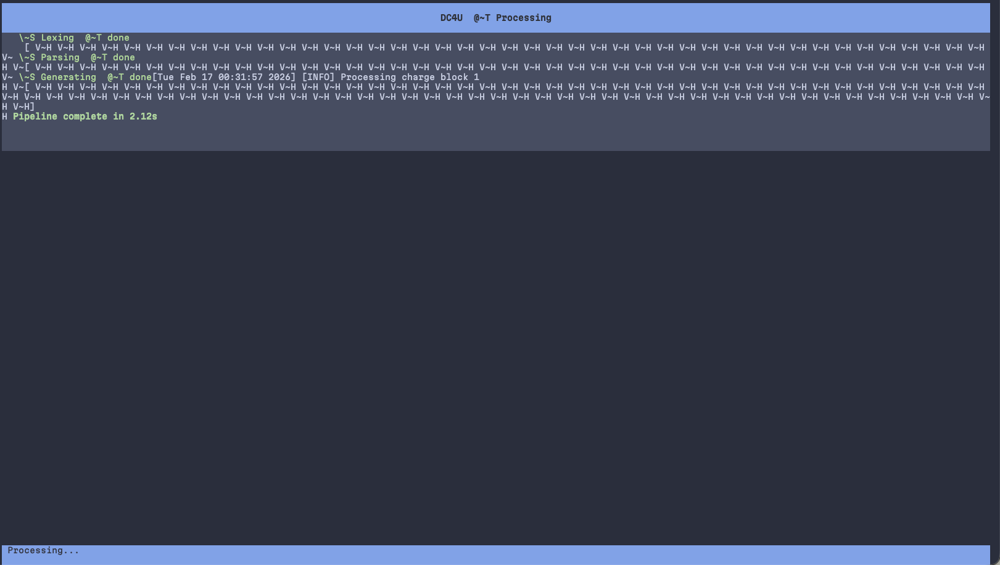
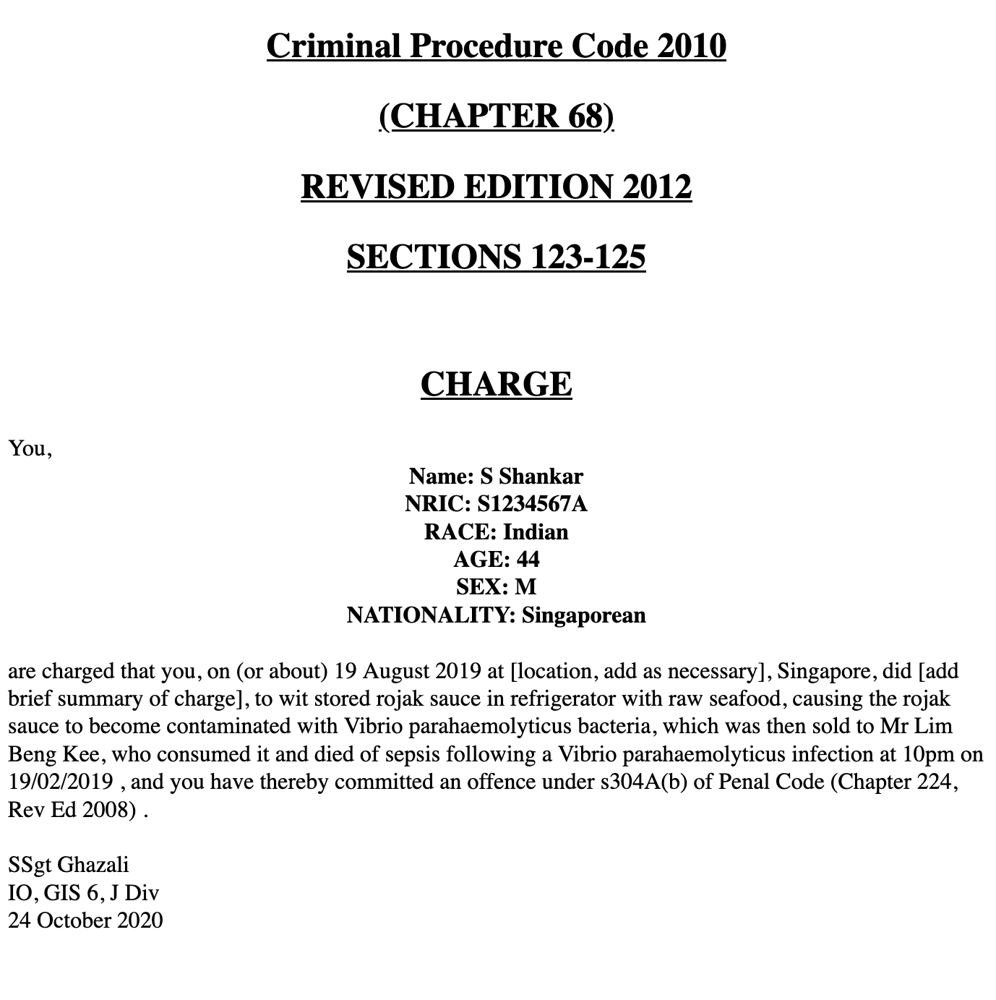
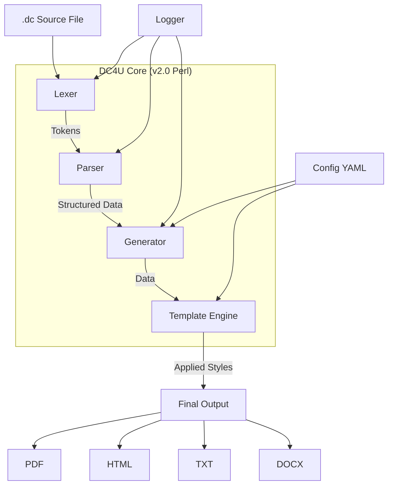
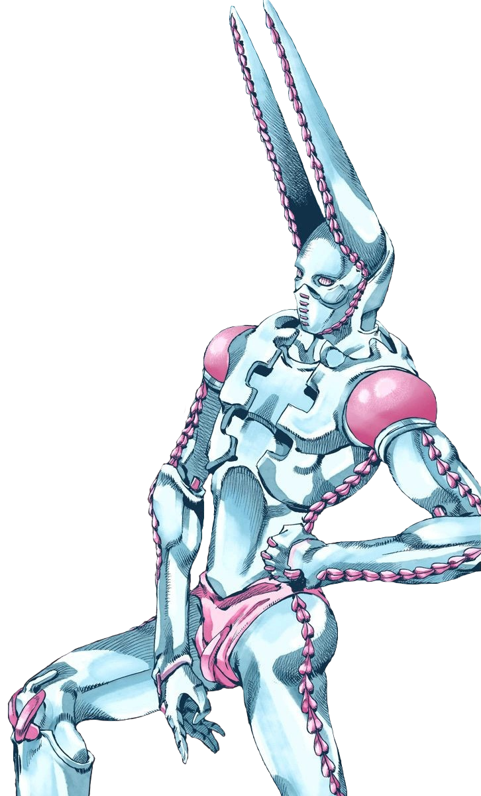

[](https://github.com/gongahkia/dc4u/releases/tag/1.0.0)
[](https://github.com/gongahkia/dc4u/releases/tag/2.0.0)
[](https://github.com/gongahkia/dc4u/releases/tag/3.0.0)


# `Draft Charges 4 U`

A Legal Draft Charge Creator.

## Motivation

[Draft charges](https://mustsharenews.com/wp-content/uploads/2018/12/TOC-Charge-Sheet.jpg) are inane to format. `DC4U` simplifies the entire process of creating Draft Charges, by transpiling a human-readable markup format (`.dc`) to [multiple targets outputs](#output-formats) for viewing and distribution.

## Purpose

* Speed up formatting of draft charges
* Simplify inane legal admin work for lawyers
* Quick integration with existing programmatic workflows via pipes
* Small source code binary and compilation target, faster compilation times

## Stack

* *Language*: [Python 3.8+](https://www.python.org/), [Perl 5.32+](https://www.perl.org/)
* *Package Manager*: [pip](https://pip.pypa.io/), [CPAN](https://www.cpan.org/)
* *Document Processing*: [R Markdown](https://rmarkdown.rstudio.com/), [Pandoc](https://pandoc.org/), [LaTeX](https://www.latex-project.org/)
* *PDF Generation*: [PDF::API2](https://metacpan.org/pod/PDF::API2), [TinyTeX](https://yihui.org/tinytex/)
* *Office Integration*: [officedown](https://davidgohel.github.io/officedown/), [RTF::Writer](https://metacpan.org/pod/RTF::Writer)
* *Configuration*: [YAML](https://yaml.org/)
* *Build System*: [Make](https://www.gnu.org/software/make/)
* *Testing*: [Perl Test Framework](https://perldoc.perl.org/perlunitut)

## Screenshots

### `DC4U` TUI

<div align="center">
    
    
</div>

<div align="center">
    
    
</div>

<div align="center">
    
    
</div>

### Eg. Draft Charge created with `DC4U`



## Usage

The below instructions are for using `DC4U` on your client machine.

1. First run the below commands to install `DC4U` locally.

```console
$ make v2-install
```

2. Alternatively, you can use the interactive TUI for a guided experience:

```console
$ make tui
```

3. For command-line usage, specify the input file and desired format:

```console
$ dc4u -f PDF samples/v2/singapore_assault.dc
```

4. Pick a color theme for the TUI and HTML/PDF output:

```console
$ dc4u --list-themes
$ dc4u -f HTML --theme gruvbox-dark samples/v2/singapore_assault.dc
```

In the TUI, press `t` from the file browser to open the live theme picker.
The chosen theme persists via the YAML config (`theme:` key).

## Color themes

| Theme            | Style                                        |
| :--------------- | :------------------------------------------- |
| `classic`        | Default DC4U palette (black ink, light)      |
| `gruvbox-dark`   | Warm retro brown background, amber accents   |
| `gruvbox-light`  | Cream background variant of Gruvbox          |
| `solarized-dark` | Solarized base03 (Schoonover)                |
| `solarized-light`| Solarized base3                              |
| `nord`           | Arctic blue palette                          |
| `dracula`        | High-contrast purple/pink                    |
| `monokai`        | Vivid green/pink classic                     |
| `tokyo-night`    | Cool blue-purple                             |
| `catppuccin`     | Pastel Mocha (darkest) flavour               |

Themes drive both the curses TUI color pairs and the HTML/PDF output via
`--dc4u-*` CSS custom properties — see `v2/lib/DC4U/Theme.pm`.

### User-defined themes

Drop a YAML file into `~/.config/dc4u/themes/<name>.yaml` (or
`$DC4U_THEME_DIR`). Scaffold one based on a built-in:

```console
$ dc4u theme create solarized-warm --base solarized-light
$ vim ~/.config/dc4u/themes/solarized-warm.yaml
$ dc4u --theme solarized-warm -f HTML case.dc
```

User themes can't shadow a built-in name. Malformed YAML is silently
skipped (run `dc4u theme list` to confirm yours loaded).

### Per-jurisdiction default theme

Pin a theme per jurisdiction in `dc4u.yaml`:

```yaml
uk:
  theme: solarized-light
singapore:
  theme: classic
```

`--theme` on the CLI always wins over the jurisdiction default.

### True-color TUI

If the terminal supports `init_color()` (most modern ones do), DC4U
reprograms color palette slots so the TUI matches the HTML output's exact
hex values. Set `DC4U_NO_TRUECOLOR=1` to force the 8-color fallback.

## Subcommands

```
dc4u init   <jurisdiction> <out.dc>           Scaffold a starter .dc
dc4u lint   [-j J] <file.dc> ...              Validate fields, NRIC, dates
dc4u anonymize [--strategy redact|hash|fake]  Strip PII (in-place or -o)
dc4u diff   [-j J] <a.dc> <b.dc>              Field-level semantic diff
dc4u bundle [--zip f.zip] [--formats ...]     Multi-format render + manifest
dc4u batch  --csv f.csv --template t.dc       CSV-driven batch rendering
dc4u theme  list | create <name> | dir        Manage color themes
dc4u audit  [--tail N]                        Show ~/.dc4u/audit.log
```

## Generator flags (file mode)

| Flag                 | Effect                                                  |
| :------------------- | :------------------------------------------------------ |
| `--watermark TEXT`   | Diagonal `DRAFT`-style overlay (HTML/PDF) or banner (TXT/MD) |
| `--watch`            | Recompile on file save until Ctrl-C                     |
| `--lint`             | Run lint first; abort on errors                         |
| `--audit-log`        | Record this generation in `~/.dc4u/audit.log`           |
| `--no-preprocess`    | Skip `@include`/`@def`/`${var}`/YAML front-matter       |

## `.dc` preprocessor directives

```
---                              # Optional YAML front-matter
case_no: A-2025-001
hearing: 12 March 2025
---

@include common/defendant.dc     # Inline another .dc file
@def $io "Sgt Lim; IO, CID; 02/01/2025"
@def $statute "s379 Penal Code"

`HTML`
<...>
[...]
@${statute}@
{${io}}
```

## Output formats

| Format | Purpose | Implementation status |
| :---: | :---: | :---: |
| `.txt` | Universal viewing and plain text output |  |
| `.md` | Markdown formatted viewing with HTML styling | |
| `.html` | Web-ready documents with CSS styling |  |
| `.rmd` | R Markdown for data visualization and analysis |  |
| `.pdf` | Professional documents via PDF::API2 (v2.0) or R/Pandoc (v1.0) |  |
| `.docx` | Microsoft Word documents via RTF::Writer (v2.0) or R/officedown (v1.0) | |

## Architecture



## Reference

The name `dc4u` is in reference to [Funny Valentine](https://jojo.fandom.com/wiki/Funny_Valentine)'s (ファニー・ヴァレンタイン) [Stand](https://jojo.fandom.com/wiki/Stand) of the same name, [Dirty Deeds Done Dirt Cheap](https://jojo.fandom.com/wiki/Dirty_Deeds_Done_Dirt_Cheap) *(often shortened to D4C)* in [Part 7: Steel Ball Run](https://jojo.fandom.com/wiki/Steel_Ball_Run) of the ongoing manga series [JoJo's Bizarre Adventure](https://jojowiki.com/JoJo_Wiki).

<div align="center">
    
</div>
